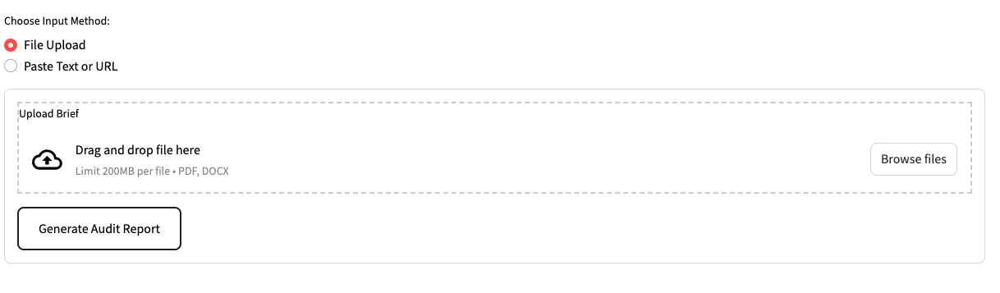

# Integrity Debt Diagnostic

**"If a machine can pass your assessment, the failure lies in the curriculum design, not the student’s character."**

The **Integrity Debt Diagnostic** is an AI-powered tool for Higher Education professionals to audit assessment briefs against the **10 Categories of Integrity Debt** (Illingworth, 2026). It identifies vulnerabilities to AI automation and provides analytical critiques to support curriculum redesign.

## Core Methodology

The diagnostic evaluates uploaded documents (PDF/DOCX) across ten critical dimensions:

1.  **Weighting**: Proportion of credit relative to effort.
2.  **Documentation**: Explicitness of academic integrity requirements.
3.  **Context**: Connection to non-generative local contexts.
4.  **Reflection**: Requirement for subjective, personal insight.
5.  **Time**: Realism of completion timelines.
6.  **Multimodal**: Requirement for non-textual outputs.
7.  **Interrogation**: Ability for the student to defend the logic.
8.  **Defence**: Presence of an oral or live component.
9.  **Collaborative**: Requirement for social interdependence.
10. **Recency**: Reliance on contemporary events (last 24 hours).

## Technical Configuration

### Installation
1. Clone the repository.
2. Install dependencies: `pip install -r requirements.txt`.
3. Create `.streamlit/secrets.toml` and add: `GEMINI_API_KEY = "your_key"`.
4. Run: `streamlit run app.py`.

### Deployment
* **Platform**: Streamlit Cloud.
* **API**: Google AI Studio (Gemini 1.5 Flash).
* **Secrets**: Add `GEMINI_API_KEY` in the Streamlit Cloud dashboard under **Advanced Settings > Secrets**.

## Intellectual Property & Consultancy

This tool is a proof-of-concept for the **Integrity Debt** framework. High scores indicate high vulnerability, threatening institutional reputation and pedagogical validity.

* **Strategy Guide**: [Download the full guide](https://samillingworth.gumroad.com/l/integrity-debt-audit)
* **Consultancy**: Contact [sam.illingworth@gmail.com](mailto:sam.illingworth@gmail.com) for curriculum audit and redesign workshops.
