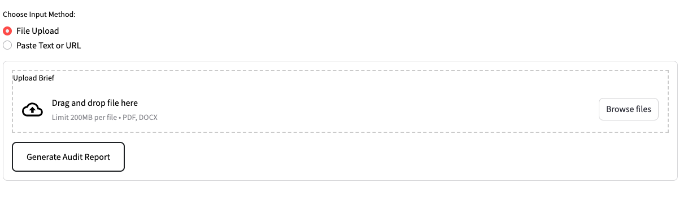

# Integrity Debt Audit

**"If a machine can pass your assessment, the failure lies in the curriculum design, not the student's character."**

[**Try the Audit Tool**](https://integrity-debt-audit.streamlit.app/) | [**Download the Strategy Guide**](https://samillingworth.gumroad.com/l/integrity-debt-audit) | [**Contact for Consultancy**](mailto:sam.illingworth@gmail.com)

---

The **Integrity Debt Audit** is an AI-powered tool for Higher Education professionals to audit assessment briefs against the **10 Categories of Integrity Debt** (Illingworth, 2026). It identifies vulnerabilities to AI automation and provides analytical critiques to support curriculum redesign.

## What to Upload

Upload an **assessment brief** as a PDF or Word document. This is the document you give to students that explains what they need to do for their assignment.

**Your document should include:**
- The assignment task or question
- Submission requirements
- Assessment criteria or marking rubric
- Any process requirements (drafts, reflections, presentations)
- Word count and deadline information

**The tool works best when your brief contains enough detail** about how the assessment works. A one-line assignment question will produce less useful results than a full brief with marking criteria and submission guidance.

## Try It With Examples

Two example assessment briefs are included in the `/examples` folder:

1. **[vulnerable-essay-brief.md](examples/vulnerable-essay-brief.md)** - A typical essay assignment that scores poorly (40-50, Critical Integrity Failure). Demonstrates an assessment highly vulnerable to AI automation.

2. **[resilient-assessment-brief.md](examples/resilient-assessment-brief.md)** - A portfolio and viva assessment that scores well (12-18, Pedagogical Sovereignty). Demonstrates an assessment designed to resist AI automation.

Download either file, convert to PDF or Word, and upload to the tool to see how the audit works.

## Create Your Own Test

To trial the tool with your own assessment:

1. **Find an existing brief** - Use an assessment you currently run, or one from a colleague (with permission)

2. **Create a simple test brief** - Write a basic assignment in Word:
   - Assignment title and module
   - The task (what students must do)
   - Word count and deadline
   - How it will be marked (even a simple list of criteria)
   - Submission method

3. **Start simple, then add detail** - Try a bare-bones brief first, then add more information to see how the scores change

**Tip:** The tool is most revealing when you upload assessments you suspect might be vulnerable. The audit will identify specifically which of the 10 categories are causing the problem.

## Core Methodology

The audit evaluates uploaded documents across ten critical dimensions:

1. **Final product weighting**: Proportion of credit distributed across formative vs. summative stages.
2. **Iterative documentation**: Requirement for evidence of the messy middle of learning (drafts, rejected ideas, process logs).
3. **Contextual specificity**: Connection to specific local, temporal, or classroom contexts that AI cannot access.
4. **Reflective criticality**: Requirement for deep, subjective personal synthesis rather than generic reflection.
5. **Temporal friction**: Time-based constraints that make rapid completion physically impossible.
6. **Multimodal evidence**: Requirement for non-textual outputs (audio, physical artifacts, hand-drawn elements).
7. **Explicit AI interrogation**: Requirement for students to critique or analyse AI-generated outputs.
8. **Real-time defence**: Presence of live interaction (viva, presentation, unscripted Q&A).
9. **Social and collaborative labour**: Requirement for verified group work and peer accountability.
10. **Data recency**: Reliance on events, datasets, or information from the last fortnight to two weeks.

Each category is scored from 1 (Slow AI/Resilient) to 5 (Fast AI/Vulnerable), with a total possible score of 50.

## Scoring Interpretation

- **10-20: Pedagogical Sovereignty** - Your assessment prioritises human agency and is resilient to AI automation.
- **21-35: Structural Drift** - Your assessment has integrity debt that may lead to shallow learning and automation risk.
- **36-50: Critical Integrity Failure** - Your assessment is currently highly vulnerable to AI automation.

## Technical Configuration

### Installation
1. Clone the repository.
2. Install dependencies: `pip install -r requirements.txt`.
3. Create `.streamlit/secrets.toml` and add: `GEMINI_API_KEY = "your_key"`.
4. Run: `streamlit run app.py`.

### Deployment
* **Platform**: Streamlit Cloud.
* **API**: Google AI Studio (Gemini 1.5 Flash).
* **Secrets**: Add `GEMINI_API_KEY` in the Streamlit Cloud dashboard under **Advanced Settings > Secrets**.

## Intellectual Property & Consultancy

This tool is a proof-of-concept for the **Integrity Debt** framework. High scores indicate high vulnerability, threatening institutional reputation and pedagogical validity.

* **Strategy Guide**: [Download the full guide](https://samillingworth.gumroad.com/l/integrity-debt-audit)
* **Consultancy**: Contact [sam.illingworth@gmail.com](mailto:sam.illingworth@gmail.com) for curriculum audit and redesign workshops.
* **Slow AI**: [theslowai.substack.com](https://theslowai.substack.com) - Critical AI literacy for educators and professionals.
